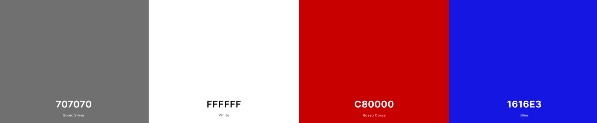
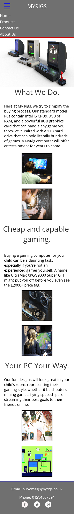
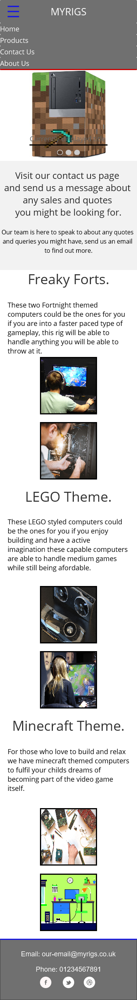

# My Rigs
(Developer: Benjamin Draper)

<!-- -->

 [Live webpage](https://benjamindraper1996.github.io/CI_PP1_MyRigs/)

## Table of Content

1. [Project Goals](#project-goals)
    1. [User Goals](#user-goals)
    2. [Site Owner Goals](#site-owner-goals)
2. [User Experience](#user-experience)
    1. [Target Audience](#target-audience)
    2. [User Requirements and Expectations](#user-requrements-and-expectations)
    3. [User Stories](#user-stories)
3. [Design](#design)
    1. [Design Choices](#design-choices)
    2. [Colour](#colours)
    3. [Fonts](#fonts)
    4. [Structure](#structure)
    5. [Wireframes](#wireframes)
4. [Technologies Used](#technologies-used)
    1. [Languages](#languages)
    2. [Frameworks & Tools](#frameworks-&-tools)

## Project Goals 

### User Goals
- Finding a website that offers a range of gaming computers for children.
- See list of the available products and designs.
- Find information about the company.
- Find the location of the company.

### Site Owner Goals
- Increase in the number of customers visiting the website.
- Promote the company to customers.
- Provide a way for new and existing customers to contact the business for sales and support queries.
- Provide essential information about the business to customers.

## User Experience

### Target Audience
- People looking for a computer for a child.
- People looking to buy a computer that is capable but have a limited budget.
- People looking for a themed computer for their child.
- People who are looking for an easy and jargon free service.

### User Requirements and Expectations

- An Intuitive and accessible navigation system.
- Easily find relevant information relating to the company and the products.
- All links work as expected and functions perform their tasks correctly.
- Presentation is in line with the company guidelines and the website is visually appealing on all screen sizes.
- Easy access to contact information.
- Easy to read Headings to draw attention to the areas of interest to the customer.
- Accessibility features.

### User Stories

#### First-time User 
1. As a first-time user, I want to know where the company is located.
2. As a first-time user, I want to know the range of their products.
3. As a first-time user, I want to know more about what the company does.
4. As a first-time user, I want to get an idea of what to expect from the look and ability of my computer.

#### Returning User
5. As a returning user, I want to see easy access to the support area.
6. As a returning user, I want to know how to contact customer support.
7. As a returning user, I want to find a phone number to call for ongoing support queries.
8. As a returning user, I want to see any new products that are available.
9. As a returning user, I want to leave some comment, suggestion, or message to the staff.
10. As a returning user, I want to find the company on social media.
11. As a returning user, I want to know who owns the company.
12. As a returning user, I want to get directions to the offices.

#### Company Owner 
13. As the company owner, I want users to find information about the products available from the company.
14. As the company owner, I want users to get to know the website. 
15. As the company owner, I want the users to be able to contact us easily.

## Design

### Design Choices
The website was designed to reflect the industrial design of most computers. The company does add a vinyl skin to their computers depending upon the chosen design and to reflect this I have added some imagery and colour that the gaming industry uses to reflect computer gaming.

### Colour

For the colour scheme the company owners chose to use a grey theme and highlight with mainly red and a little bit of blue to draw attention to certain areas while still reflecting both the industrial and gaming themes. To narrow down the colours I used https://coolors.co/.
 

### Fonts
The business owners preferred the use of Inter font as the main, with a backup of sans-serif across the website. This is used to maintain a Consistent and professional look with an easily readable format. 
 
For the Secondary font the owners decided to use Quicksand with a backup of sans-serif, this will be used for emphasis and future changes to the website should there be major content updates. 

### Structure
The page is structured in a regularly used, well know, user friendly, and easy to navigate. Upon arriving to the website, the user sees a familiar type of navigation bar with the company name on the left side and the navigation links to the links along the top. 
The website consists of four separate pages: 
- A homepage with a section for “What We Do”, “Cheap and Powerful Gaming” and “Your PC Your Way”.
- A products page with a carousel and information about all the products available.
- A contact us page with a contact form, a map, and the company office location.
- An about us page with the information about the owners, the security measures they take and the additional services they can offer.

### Wireframes

Mobile Design

Home Page

Products Page

Contact Us Page

About Us Page

Desktop Design

Home Page

Products Page

Contact Us Page

About Us Page

## Technologies Used

### Languages
- HTML
- CSS

### Frameworks & Tools
- Bootstrap v5.0
- Git
- GitHub
- Gitpod 
- JustInMind
- Google Fonts 
- Favicon.io
- coolors
- Am I Responsive?

## Features

### Logo and Navigation Bar
- Featured on all four pages.
- The navigation bar is fully responsive and changes to a toggler (hamburger menu) on smaller screens and includes links to the Homepage, Products, Contact Us and About Us page.
- It allows users to easily navigate the website.
- The link for the page the user is currently hovering over is underlined. 
- User stories covered: 5,6,14 

### Carousel
- Introduces the user to the range of products with pictures and a title for each.
- arrow selectors to allow the user to navigate the slide show back and forward.
- User stories covered: 2,4,8,13

### Google Maps API
- Allows the user to see the location of the company offices and the surrounding area
- User stories covered: 1,12,15

### Footer
- Featured on all four pages
- Consists of two separate divs: contact information, and social media links
- User stories covered: 7,10,15

### Company address
-  The Company Address allows users to find the company by their address, this can be used by some users with a Satnav or externally in Google maps.
- User stories covered: 1,12,15

### Products 
- Gives an overview of the products in three sections one for each product currently available. This allows the website to be easily expanded later as more products are added.
- Each product is accompanied with two images one of each design type to allow the users to make a better choice.
- Features description of design.
- User stories covered: 2,3,4,8,13

### Accordion
- Provides the user with information about the company while not displaying too much information at once, this is easily expandable in later versions should the site owner wish to do so.
- User stories covered: 3,11

<!--  -->

### About Us
- Gives a description of the services the company can offer, the security measures they take to keep customers safe and an introduction to the owners of the company.
- User stories covered: 3,11,13

<!--  -->

### Meet the Owner
- Features a short story about how the two owners of the website got together and decided to create the company.
- User stories covered: 11

<!-- -->

### Contact form
- Allows users to contact customer support for sales and support queries, this initiates an email conversation between the user and the support team.
- User stories covered: 6,9,15

<!--  -->

### Customer support
- Allows users to contact customer support for sales and support queries, this can be done through the contact form, over email, social media and by phone.
- User stories covered: 5,6,7,9,10,15
