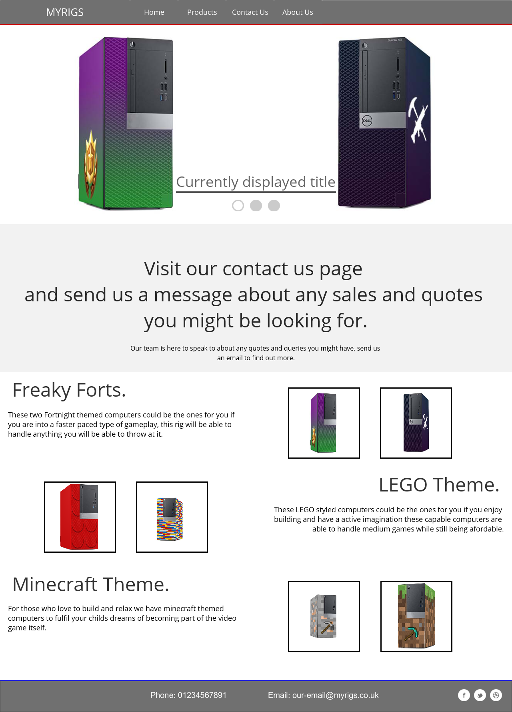
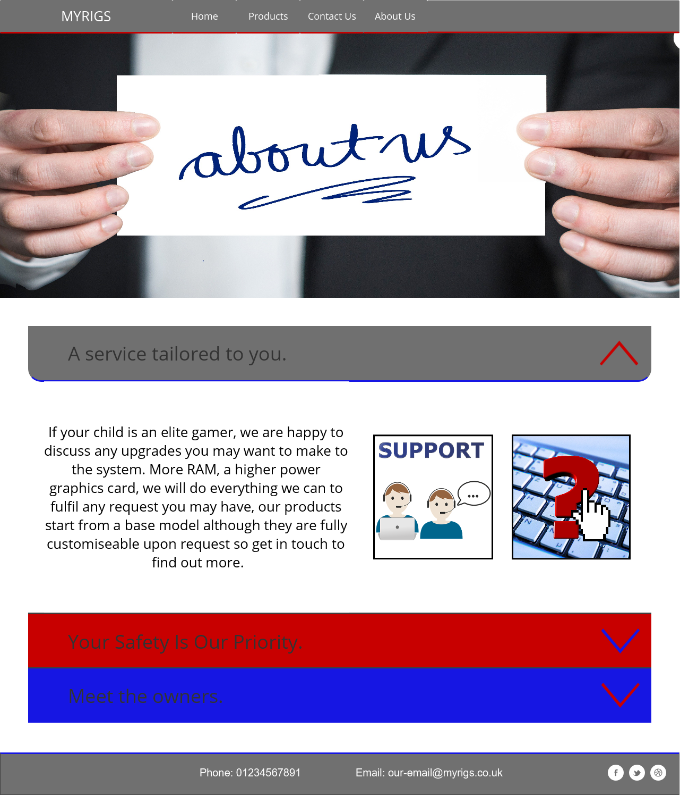
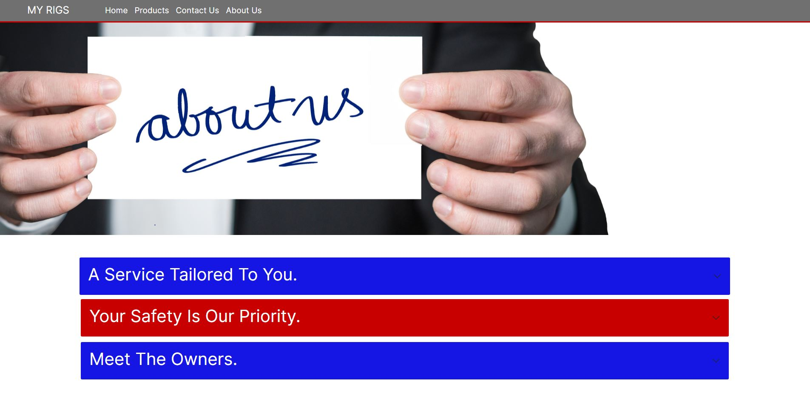
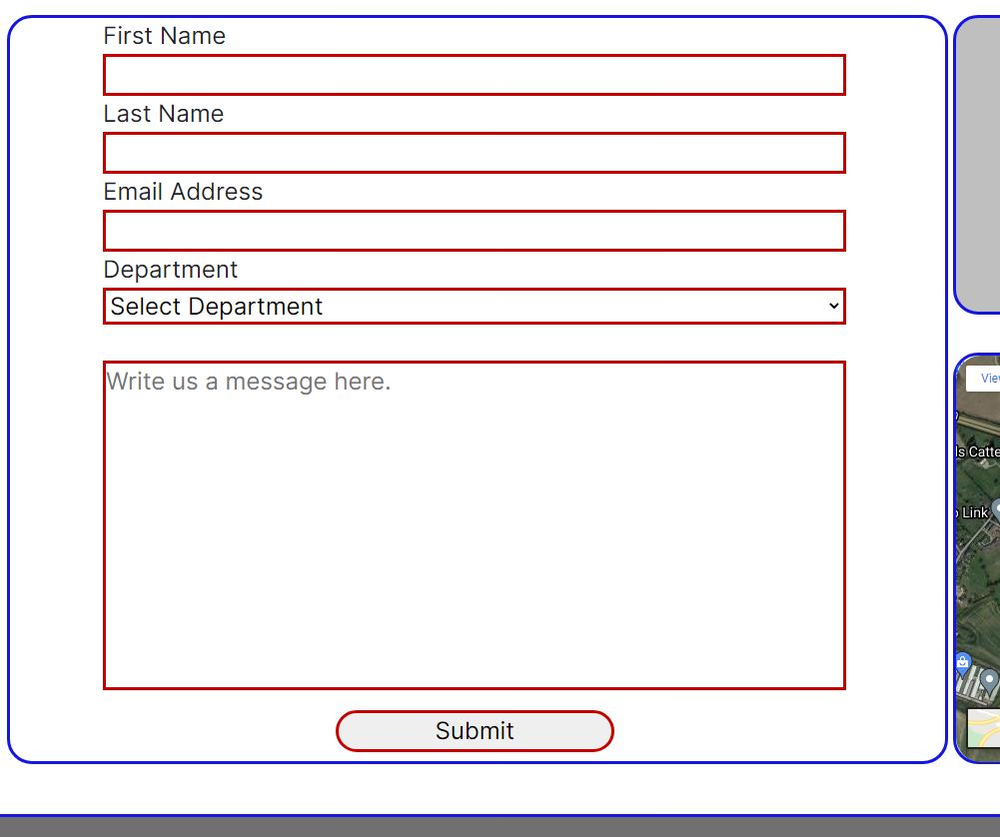
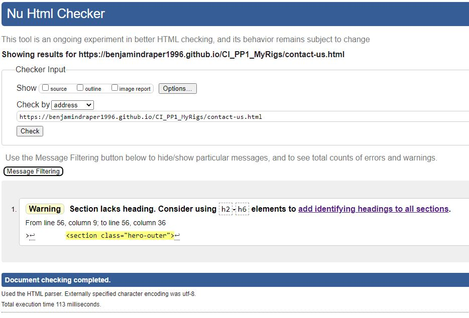
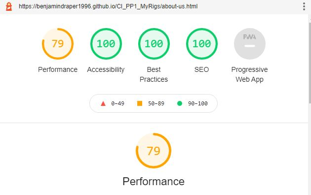
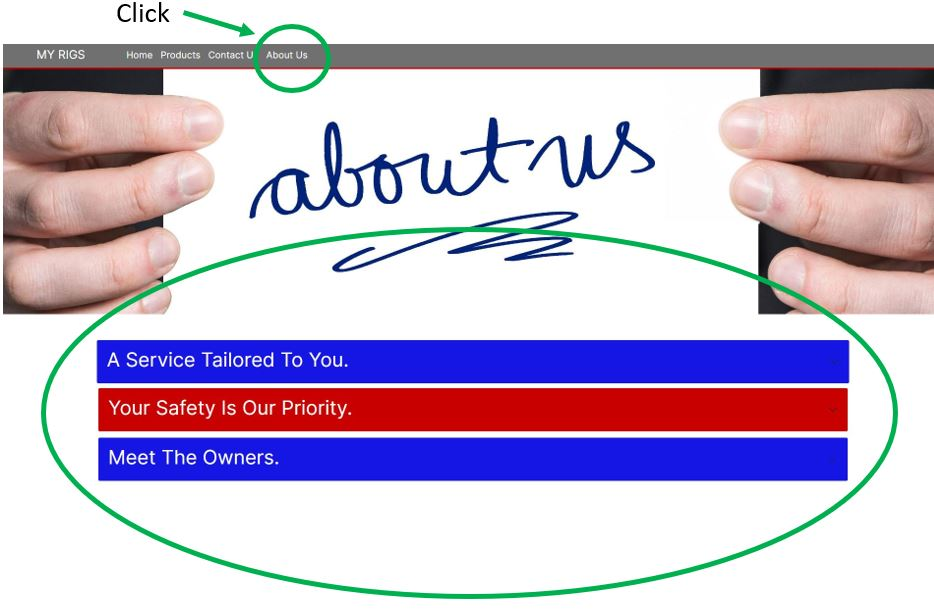

# My Rigs
(Developer: Benjamin Draper)

 [Live webpage](https://benjamindraper1996.github.io/CI_PP1_MyRigs/)

## Table of Content

1. [Project Goals](#project-goals)
    1. [User Goals](#user-goals)
    2. [Site Owner Goals](#site-owner-goals)
2. [User Experience](#user-experience)
    1. [Target Audience](#target-audience)
    2. [User Requirements and Expectations](#user-requrements-and-expectations)
    3. [User Stories](#user-stories)
3. [Design](#design)
    1. [Design Choices](#design-choices)
    2. [Colour](#colours)
    3. [Fonts](#fonts)
    4. [Structure](#structure)
    5. [Wireframes](#wireframes)
4. [Technologies Used](#technologies-used)
    1. [Languages](#languages)
    2. [Frameworks & Tools](#frameworks-&-tools)
5. [Features](#features)
6. [Testing](#validation)
    1. [HTML Validation](#HTML-validation)
    2. [CSS Validation](#CSS-validation)
    3. [Accessibility](#accessibility)
    4. [Performance](#performance)
    5. [Device testing](#performing-tests-on-various-devices)
    6. [Browser compatibility](#browser-compatability)
    7. [Testing user stories](#testing-user-stories)
8. [Bugs](#Bugs)
9. [Deployment](#deployment)
10. [Credits](#credits)
11. [Acknowledgements](#acknowledgements)

## Project Goals 

### User Goals
- Finding a website that offers a range of gaming computers for children.
- See list of the available products and designs.
- Find information about the company.
- Find the location of the company.

### Site Owner Goals
- Increase in the number of customers visiting the website.
- Promote the company to customers.
- Provide a way for new and existing customers to contact the business for sales and support queries.
- Provide essential information about the business to customers.

## User Experience

### Target Audience
- People looking for a computer for a child.
- People looking to buy a computer that is capable but have a limited budget.
- People looking for a themed computer for their child.
- People who are looking for an easy and jargon free service.

### User Requirements and Expectations

- An Intuitive and accessible navigation system.
- Easily find relevant information relating to the company and the products.
- All links work as expected and functions perform their tasks correctly.
- Presentation is in line with the company guidelines and the website is visually appealing on all screen sizes.
- Easy access to contact information.
- Easy to read Headings to draw attention to the areas of interest to the customer.
- Accessibility features.

### User Stories

#### First-time User 
1. As a first-time user, I want to know where the company is located.
2. As a first-time user, I want to know the range of their products.
3. As a first-time user, I want to know more about what the company does.
4. As a first-time user, I want to get an idea of what to expect from the look and ability of my computer.

#### Returning User
5. As a returning user, I want to see easy access to the support area.
6. As a returning user, I want to know how to contact customer support.
7. As a returning user, I want to find a phone number to call for ongoing support queries.
8. As a returning user, I want to see any new products that are available.
9. As a returning user, I want to leave some comment, suggestion, or message to the staff.
10. As a returning user, I want to find the company on social media.
11. As a returning user, I want to know who owns the company.
12. As a returning user, I want to get directions to the offices.

#### Company Owner 
13. As the company owner, I want users to find information about the products available from the company.
14. As the company owner, I want users to get to know the website. 
15. As the company owner, I want the users to be able to contact us easily.
16. As the company owner, I want the website to act in a responsive manner on all devices.
17. As the company owner, I want users to get redirected to a custom 404 error page if they type in a wrong link into thier browser.

## Design

### Design Choices
The website was designed to reflect the industrial design of most computers. The company does add a vinyl skin to their computers depending upon the chosen design and to reflect this I have added some imagery and colour that the gaming industry uses to reflect computer gaming.

### Colour

For the colour scheme the company owners chose to use a grey theme and highlight with mainly red and a little bit of blue to draw attention to certain areas while still reflecting both the industrial and gaming themes. To narrow down the colours I used https://coolors.co/.
 

### Fonts
The business owners preferred the use of Inter font as the main, with a backup of sans-serif across the website. This is used to maintain a Consistent and professional look with an easily readable format. 
 
For the Secondary font the owners decided to use Quicksand with a backup of sans-serif, this will be used for emphasis and future changes to the website should there be major content updates. 

### Structure
The page is structured in a regularly used, well know, user friendly, and easy to navigate. Upon arriving to the website, the user sees a familiar type of navigation bar with the company name on the left side and the navigation links to the links along the top. 
The website consists of four separate pages: 
- A homepage with a section for “What We Do”, “Cheap and Powerful Gaming” and “Your PC Your Way”.
- A products page with a carousel and information about all the products available.
- A contact us page with a contact form, a map, and the company office location.
- An about us page with the information about the owners, the security measures they take and the additional services they can offer.

### Wireframes

Mobile Design

Home Page

Products Page

Contact Us Page

About Us Page

Desktop Design

Home Page

Products Page

Contact Us Page

About Us Page

## Technologies Used

### Languages
- HTML
- CSS

### Frameworks & Tools
- Bootstrap v5.0
- Git
- GitHub
- Gitpod 
- JustInMind
- Google Fonts 
- Favicon.io
- coolors
- Am I Responsive?

## Features

### Logo and Navigation Bar
- Featured on all four pages.
- The navigation bar is fully responsive and changes to a toggler (hamburger menu) on smaller screens and includes links to the Homepage, Products, Contact Us and About Us page.
- It allows users to easily navigate the website.
- The link for the page the user is currently hovering over is underlined. 
- User stories covered: 5,6,14 

### Carousel
- Introduces the user to the range of products with pictures and a title for each.
- arrow selectors to allow the user to navigate the slide show back and forward.
- User stories covered: 2,4,8,13

### Google Maps API
- Allows the user to see the location of the company offices and the surrounding area
- User stories covered: 1,12,15

### Footer
- Featured on all four pages
- Consists of two separate divs: contact information, and social media links
- User stories covered: 7,10,15

### Company address
-  The Company Address allows users to find the company by their address, this can be used by some users with a Satnav or externally in Google maps.
- User stories covered: 1,12,15

### Products 
- Gives an overview of the products in three sections one for each product currently available. This allows the website to be easily expanded later as more products are added.
- Each product is accompanied with two images one of each design type to allow the users to make a better choice.
- Features description of design.
- User stories covered: 2,3,4,8,13

### Accordion
- Provides the user with information about the company while not displaying too much information at once, this is easily expandable in later versions should the site owner wish to do so.
- User stories covered: 3,11

### About Us
- Gives a description of the services the company can offer, the security measures they take to keep customers safe and an introduction to the owners of the company.
- User stories covered: 3,11,13

### Meet the Owner
- Features a short story about how the two owners of the website got together and decided to create the company.
- User stories covered: 11

### Contact form
- Allows users to contact customer support for sales and support queries, this initiates an email conversation between the user and the support team.
- User stories covered: 6,9,15

### Customer support
- Allows users to contact customer support for sales and support queries, this can be done through the contact form, over email, social media and by phone.
- User stories covered: 5,6,7,9,10,15

### Review
- Allows users to contact customer support and leave a review through the contact form on the contact us page.
- User stories covered: 6,9

### Responsive Design
- 
- User stories covered: 

## Validation

### HTML Validation
I used the W3C Validation Service to validate the HTML of the website.
The Product page passed validation with no errors, The Home, Contact Us and About Us pages passed with one warning where teh hero image had no header, this was intentional as it is only used to display the hero image.

Home Page

Products Page

Contact Us Page

About Us Page 

### CSS Validation
I used the W3C Jigsaw CSS Validation Service to validate the CSS of the website.
My CSS passed with no errors and one warning relating to impoting of external stylesheets.

CSS Validation

### Accessibility
I used WAVE WebAIM web accessibility evaluation tool to ensure the website met high accessibility standards. All pages passed with no errors and minimal warnings.

Home Page

Products Page

Contact Us Page

About Us Page

### Performance 
Google Lighthouse in Google Chrome Developer Tools was used to test the performance of the website. 

Home Page

Products Page

Contact Us Page

About Us Page

### Performing tests on various devices 
The website was tested on the following devices:
- HP Envy X360 (both in pc and tablet mode)
- MacBook Pro 13” 2019
- Samsung Galaxy S21 FE 5G

In addition, the website was tested using Google Chrome Developer Tools Device Toggling option for all available device options.

### Browser compatibility
The website was tested on the following browsers:
- Google Chrome
- Mozilla Firefox
- Microsoft Edge

### Testing user stories

1. As a first-time user, I want to know where the company is located.

| **Feature** | **Action** | **Expected Result** | **Actual Result** |
|-------------|------------|---------------------|-------------------|
| Google Maps API | Navigate to the Contact Us page, locate the Google Map | Locating a map showing the location of the company. | Works as expected |

Screenshots

2. As a first-time user, I want to know the range of their products.

| **Feature** | **Action** | **Expected Result** | **Actual Result** |
|-------------|------------|---------------------|-------------------|
| Products | Navigate to the Products page | See the Products on the products page | Works as expected |

Screenshots

3. As a first-time user, I want to know more about what the company does.

| **Feature** | **Action** | **Expected Result** | **Actual Result** |
|-------------|------------|---------------------|-------------------|
| About Us | Navigate to the About page | Find description of what services the company offers, the security measures they take and the information about the owners| Works as expected |

Screenshots

4. As a first-time user, I want to get an idea of what to expect from the look and ability of my computer.

| **Feature** | **Action** | **Expected Result** | **Actual Result** |
|-------------|------------|---------------------|-------------------|
| Products | Navigate to the Products page | Find pictures and information of the products on offer from the company | Works as expected |

Screenshots

5. As a returning user, I want to see easy access to the support area.

| **Feature** | **Action** | **Expected Result** | **Actual Result** |
|-------------|------------|---------------------|-------------------|
| Customer support | Navigate to the Contact Us page and locate the contact form | Find the contact form on Contact Us page | Works as expected |

Screenshots

6. As a returning user, I want to know how to leave a review.

| **Feature** | **Action** | **Expected Result** | **Actual Result** |
|-------------|------------|---------------------|-------------------|
| Review | Navigate to the contact us page and use the form to leave a review | The user finds the form and form data is sent to the company. | Works as expected |

Screenshots

7. As a returning user, I want to find a phone number to call for ongoing support queries.

| **Feature** | **Action** | **Expected Result** | **Actual Result** |
|-------------|------------|---------------------|-------------------|
| Footer | On all pages scroll to the footer | See the phone number | Works as expected |

Screenshots

8. As a returning user, I want to see any new products that are available.

| **Feature** | **Action** | **Expected Result** | **Actual Result** |
|-------------|------------|---------------------|-------------------|
| Carousel | Navigate to the Products page | See any new available products | Works as expected |

Screenshots

9. As a returning user, I want to leave some comment, suggestion, or message to the staff.

| **Feature** | **Action** | **Expected Result** | **Actual Result** |
|-------------|------------|---------------------|-------------------|
| Contact Form | Navigate to the Contact Us Page and locate the contact form, fill out and submit contact form | Data submitted via contact form | Works as expected |

Screenshots

10. As a returning user, I want to find the company on social media.

| **Feature** | **Action** | **Expected Result** | **Actual Result** |
|-------------|------------|---------------------|-------------------|
| Footer | On all pages scroll to the footer of the page | Click on one of the three social media links | Works as expected | 

Screenshots

11. As a returning user, I want to know who owns the company.

| **Feature** | **Action** | **Expected Result** | **Actual Result** |
|-------------|------------|---------------------|-------------------|
| Meet the owner | Navigate to the About Us page and scroll down and open the Meet the Owner section of the accordion | Find brief introduction to the owners and the company | Works as expected |

Screenshots

12. As a returning user, I want to get directions to the offices.

| **Feature** | **Action** | **Expected Result** | **Actual Result** |
|-------------|------------|---------------------|-------------------|
| Company address | Navigate to the Contact Us page, locate the company address | See address to the company offices | Works as expected |

Screenshots

13. As the company owner, I want users to find information about the products available from the company.

| **Feature** | **Action** | **Expected Result** | **Actual Result** |
|-------------|------------|---------------------|-------------------|
| Products | Navigate to the Products page | See the information available products for the products on offer | Works as expected |

Screenshots

14. As the company owner, I want users to get to know the website. 

| **Feature** | **Action** | **Expected Result** | **Actual Result** |
|-------------|------------|---------------------|-------------------|
| About Us | Navigate to About page and locate Accordion information | See relevant information about the company | Works as expected |

Screenshots

15. As the company owner, I want the users to be able to contact us easily.

| **Feature** | **Action** | **Expected Result** | **Actual Result** |
|-------------|------------|---------------------|-------------------|
| Contact Form | Navigate to the Contact Us Page, locate the contact form and submit a completed contact form | Data submitted via contact form | Works as expected |
| Footer | On all pages scroll to the footer of the page | Click on one of the three social media links | Works as expected |
| Footer | On any page scroll down to the footer | Find the phone number | Works as expected |

Screenshots

16. As the company owner, I want the website to act in a responsive manner on all devices.

| **Feature** | **Action** | **Expected Result** | **Actual Result** |
|-------------|------------|---------------------|-------------------|
| Responsive Design | View the Website on various devices, desktop, laptop and mobile. | Website is responsive and re-sizes depending upon the viewport. | Works as expected. |

17. As the company owner, I want users to get redirected to a custom 404 error page if they type in a wrong link into thier browser.

| **Feature** | **Action** | **Expected Result** | **Actual Result** |
|-------------|------------|---------------------|-------------------|
| 404 Feature | Navigate to the any page of the website and type in to the address bar of the browser an incorrect url | User is redirected to the 404.html page | Works as expected |

## Bugs

| **Bug** | **Fix** |
| ----------- | ----------- |
| The user can submit a contact form input without a message | Add required attribute to message input field |
| The Social media icons took the current tab to the new website instead of opening in a new tab | Add target="_blank" attribute to 'a' tag |
| When viewed on tablets, the google maps API I used moved the pin around on the map | Swap to a iframe embedded version of google maps |
| Navbar divides into two rows on xs screen size | Using bootstrap to create a burger style dropdown menu when the screen is too small |
| Removed whitespace after footer but body contents overlaps with footer | Removed "position: absolute" from footer |
## Deployment

The website was deployed using GitHub Pages by following these steps:
1. In the GitHub repository navigate to the Settings tab
2. On the left-hand menu select Pages
3. For the source select Branch: master
4. After the webpage refreshes automatically you will see a ribbon on the top saying: "Your site is published at https://benjamindraper1996.github.io/CI_PP1_MyRigs/

You can fork the repository by following these steps:
1. Go to the GitHub repository
2. Click on Fork button in upper right-hand corner

You can clone the repository by following these steps:
1. Go to the GitHub repository 
2. Locate the Code button above the list of files and click it 
3. Select if you prefer to clone using HTTPS, SSH, or Github CLI and click the copy button to copy the URL to your clipboard
4. Open Git Bash
5. Change the current working directory to the one where you want the cloned directory
6. Type git clone and paste the URL from the clipboard ($ git clone https://github.com/YOUR-USERNAME/YOUR-REPOSITORY)
7.Press Enter to create your local clone.

## Credits
Images and Logos not referenced below are owned by the developer.

### Media

Some of the pictures below were edited after being sourced from the following resources, this was either to aid in the website design or to allow for proper mockups of the company products to be created in the absence of final versions.

In order of apearance:
- [home-screen-hero ](assets/images/home-screen-hero.webp): Photo by <a href="https://pixabay.com/users/sergeitokmakov-3426571/">Sergei Tokmakov</a> on <a href="https://pixabay.com/illustrations/computer-8-bit-old-retro-isolated-4812101/">Pixabay</a>
- [gamer-boy-2 ](assets/images/gamer-boy2.webp): Photo by <a href="https://pixabay.com/users/tomasz_mikolajczyk-106840/">Tomasz Mikołajczyk</a> on <a href="https://pixabay.com/photos/game-strategy-computer-289470/">Pixabay</a>
- [computer-repair ](assets/images/computer-repair.webp): Photo by <a href="https://pixabay.com/users/jeshoots-com-264599/">Jan Vašek</a> on <a href="https://pixabay.com/photos/pc-hardware-man-personal-computer-5737958/">Pixabay</a>
- [gamer-girl ](assets/images/gamer-girl.webp): Photo by <a href="https://pixabay.com/users/tomasz_mikolajczyk-106840/">Tomasz Mikołajczyk</a> on <a href="https://pixabay.com/photos/player-playing-woman-headphones-760184/">Pixabay</a>
- [two-graphics-cards ](assets/images/two-graphics-cards.webp): Photo by <a href="https://pixabay.com/users/nanadua11-4908484/">Nana Dua</a> on <a href="https://pixabay.com/photos/nvidia-graphic-card-bitcoin-gpu-5264921/">Pixabay</a>
- [computer-parts ](assets/images/computer-parts.webp): Photo by <a href="https://pixabay.com/users/marijana1-8558212/">marijana1</a> on <a href="https://pixabay.com/photos/hardware-electronics-repair-service-3509891/">Pixabay</a>
- [computer-desk ](assets/images/computer-desk.webp): Photo by <a href="https://pixabay.com/users/mizo15-19347370/">Hamza Boukhou</a> on <a href="https://pixabay.com/illustrations/office-room-desk-computer-pc-5794722/">Pixabay</a>
- [facebook ](assets/images/facebook.PNG): Photo by <a href="https://pixabay.com/users/sasiepre-15891229/">Sasithon Prehofer</a> on <a href="https://pixabay.com/vectors/social-media-marketing-social-icons-5995266/">Pixabay</a>
- [twitter ](assets/images/twitter.PNG): Photo by <a href="https://pixabay.com/users/sasiepre-15891229/">Sasithon Prehofer</a> on <a href="https://pixabay.com/vectors/social-media-marketing-social-icons-5995266/">Pixabay</a>
- [instagram ](assets/images/instagram.PNG): Photo by <a href="https://pixabay.com/users/sasiepre-15891229/">Sasithon Prehofer</a> on <a href="https://pixabay.com/vectors/social-media-marketing-social-icons-5995266/">Pixabay</a>
- [lego-brick-pc ](assets/images/lego-brick-pc.webp): Photo by <a href="https://www.europc.co.uk/">EuroPC</a> on <a href="https://www.europc.co.uk/dell-optiplex-xe3-mini-tower-intel-core-i5-8500-8gb-ram-256gb-ssd-dell-3-yr-wty-148277.html">EuroPC</a>
- [lego-brick-wall-pc ](assets/images/lego-brick-wall-pc.webp): Photo by <a href="https://www.europc.co.uk/">EuroPC</a> on <a href="https://www.europc.co.uk/dell-optiplex-xe3-mini-tower-intel-core-i5-8500-8gb-ram-256gb-ssd-dell-3-yr-wty-148277.html">EuroPC</a>
- [minecraft-grass-pc ](assets/images/minecraft-grass-pc.jwebp): Photo by <a href="https://www.europc.co.uk/">EuroPC</a> on <a href="https://www.europc.co.uk/dell-optiplex-xe3-mini-tower-intel-core-i5-8500-8gb-ram-256gb-ssd-dell-3-yr-wty-148277.html">EuroPC</a>
- [minecraft-ore-pc ](assets/images/minecraft-ore-pc.webp): Photo by <a href="https://www.europc.co.uk/">EuroPC</a> on <a href="https://www.europc.co.uk/dell-optiplex-xe3-mini-tower-intel-core-i5-8500-8gb-ram-256gb-ssd-dell-3-yr-wty-148277.html">EuroPC</a>
- [freaky-forts-black ](assets/images/freaky-forts-black.webp): Photo by <a href="https://www.europc.co.uk/">EuroPC</a> on <a href="https://www.europc.co.uk/dell-optiplex-xe3-mini-tower-intel-core-i5-8500-8gb-ram-256gb-ssd-dell-3-yr-wty-148277.html">EuroPC</a>
- [freaky-forts-green ](assets/images/freaky-forts-green.webp): Photo by <a href="https://www.europc.co.uk/">EuroPC</a> on <a href="https://www.europc.co.uk/dell-optiplex-xe3-mini-tower-intel-core-i5-8500-8gb-ram-256gb-ssd-dell-3-yr-wty-148277.html">EuroPC</a>
- [contact-us-hero ](assets/images/contact-us-hero.webp): Photo by <a href="https://pixabay.com/users/jessica45-2055892/">jessica45</a> on <a href="https://pixabay.com/photos/contact-us-contact-e-mail-2355449/">Pixabay</a>
- [about-us-hero ](assets/images/about-us-hero.webp): Photo by <a href="https://pixabay.com/users/geralt-9301/">Gerd Altmann</a> on <a href="https://pixabay.com/photos/imprint-about-us-map-hand-finger-2508603/">Pixabay</a>
- [keyboard-questionmark ](assets/images/keyboard-questionmark.webp): Photo by <a href="https://pixabay.com/users/geralt-9301/">Gerd Altmann</a> on <a href="https://pixabay.com/illustrations/keyboard-help-support-information-824317/">Pixabay</a>
- [support ](assets/images/support.webp): Photo by <a href="https://pixabay.com/users/pixaline-1569622/">Sabine Kroschel</a> on <a href="https://pixabay.com/vectors/support-help-hotline-headset-1984615/">Pixabay</a>
- [secuity ](assets/images/secuity.webp): Photo by <a href="https://pixabay.com/users/pixelcreatures-127599/">Werner Moser</a> on <a href="https://pixabay.com/photos/security-protection-antivirus-265130/">Pixabay</a>
- [gamer-boy ](assets/images/gamer-boy.webp): Photo by <a href="https://pixabay.com/users/explorerbob-3093227/">ExplorerBob</a> on <a href="https://pixabay.com/photos/child-play-game-technology-3264751/">Pixabay</a>
- [model-owner-jake ](assets/images/model-owner-jake.webp): Photo by <a href="https://pixabay.com/users/royalanwar-4597881/">Royal Anwar</a> on <a href="https://pixabay.com/photos/model-businessman-corporate-2911330/">Pixabay</a>
- [model-owner-diana ](assets/images/model-owner-diana.webp): Photo by <a href="https://pixabay.com/users/geralt-9301/">Gerd Altmann</a> on <a href="https://pixabay.com/illustrations/training-development-businesswoman-4497345/">Pixabay</a>
- [404-page ](assets/images/404-page.webp): Photo by <a href="https://pixabay.com/users/socialcreationsstudio-2039955/">Shelby Weers</a> on <a href="https://pixabay.com/illustrations/mistake-404-error-computer-website-1194670/">Pixabay</a>

### Code
In order of appearance:
-  The HTML responsive and toggling [Navbar from bootstrap](https://getbootstrap.com/docs/5.1/components/navbar/#toggler) was used from the bootstrap v5.1 documentation code documentation and added to each header page of the website.
-  The HTML [Carousel from bootstrap](https://getbootstrap.com/docs/5.1/components/carousel/#dark-variant) was used to display new products available from the company, i used the dark variant and added the "carousel-fade" attribute and accompanying CSS code into my own style.css for a custom slide change.
- The embedded iframe [Google map](https://google-map-generator.com/) HTML was generated using Google's map generator, this allows me to add a map to the page without the need for my own API.
- The HTML for the [toggling accordion](https://getbootstrap.com/docs/5.1/components/accordion/#always-open) was used from the bootstrap v5.1 documentation code documentation and added to the about us page of the website.
- The 404 page was made using the build guide on [GitHub Docs](https://docs.github.com/en/pages/getting-started-with-github-pages/creating-a-custom-404-page-for-your-github-pages-site), I then reused the header, footer and found a relevant image for the body.

## Acknowledgements
I would like to take the opportunity to thank:
- My mentor Mo Shami, for his feedback, advice, guidance and support.
- My partner Megan Fox, for her support advice, help testing and allowing me the free time to work on my project.
- Lee Webb on slack (lee webb2015) for his help pointing me in the right direction towards bootstrap.
- To the Code Institute Slack community for providing help and support.
- To Dominic Wingfield who is the real owner of the company but did not opt to be the face of of it only the inspiration behind it.