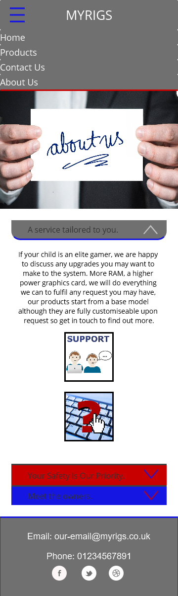

# My Rigs
(Developer: Benjamin Draper)

<!-- -->

 [Live webpage](https://benjamindraper1996.github.io/CI_PP1_MyRigs/)

## Table of Content

<!-- table of content to be made last -->

## Project Goals 

### User Goals
- Finding a website that offers a range of gaming computers for children.
- See list of the available products and designs.
- Find information about the company.
- Find the location of the company.

### Site Owner Goals
- Increase in the number of customers visiting the website.
- Promote the company to customers.
- Provide a way for new and existing customers to contact the business for sales and support queries.
- Provide essential information about the business to customers.

## User Experience

### Target Audience
- People looking for a computer for a child.
- People looking to buy a computer that is capable but have a limited budget.
- People looking for a themed computer for their child.
- People who are looking for an easy and jargon free service.

### User Requirements and Expectations

- An Intuitive and accessible navigation system.
- Easily find relevant information relating to the company and the products.
- All links work as expected and functions perform their tasks correctly.
- Presentation is in line with the company guidelines and the website is visually appealing on all screen sizes.
- Easy access to contact information.
- Easy to read Headings to draw attention to the areas of interest to the customer.
- Accessibility features.

### User Stories

#### First-time User 
1. As a first-time user, I want to know where the company is located.
2. As a first-time user, I want to know the range of their products.
3. As a first-time user, I want to know more about what the company does.
4. As a first-time user, I want to get an idea of what to expect from the look and ability of my computer.

#### Returning User
5. As a returning user, I want to see easy access to the support area.
6. As a returning user, I want to know how to contact customer support.
7. As a returning user, I want to find a phone number to call for ongoing support queries.
8. As a returning user, I want to see any new products that are available.
9. As a returning user, I want to leave some comment, suggestion, or message to the staff.
10. As a returning user, I want to find the company on social media.
11. As a returning user, I want to know who owns the company.
12. As a returning user, I want to get directions to the offices.

#### Company Owner 
13. As the company owner, I want users to find information about the products available from the company.
14. As the company owner, I want users to get to know the website. 
15. As the company owner, I want the users to be able to contact us easily.

## Design

### Design Choices
The website was designed to reflect the industrial design of most computers. The company does add a vinyl skin to their computers depending upon the chosen design and to reflect this I have added some imagery and colour that the gaming industry uses to reflect computer gaming.

### Colour

For the colour scheme the company owners chose to use a grey theme and highlight with mainly red and a little bit of blue to draw attention to certain areas while still reflecting both the industrial and gaming themes. To narrow down the colours I used https://coolors.co/.
 

### Fonts
The business owners preferred the use of Inter font as the main, with a backup of sans-serif across the website. This is used to maintain a Consistent and professional look with an easily readable format. 
 
For the Secondary font the owners decided to use Quicksand with a backup of sans-serif, this will be used for emphasis and future changes to the website should there be major content updates. 

### Structure
The page is structured in a regularly used, well know, user friendly, and easy to navigate. Upon arriving to the website, the user sees a familiar type of navigation bar with the company name on the left side and the navigation links to the links along the top. 
The website consists of four separate pages: 
- A homepage with a section for “What We Do”, “Cheap and Powerful Gaming” and “Your PC Your Way”.
- A products page with a carousel and information about all the products available.
- A contact us page with a contact form, a map, and the company office location.
- An about us page with the information about the owners, the security measures they take and the additional services they can offer.

### Wireframes

Mobile Design

Home Page

Products Page

Contact Us Page

About Us Page

Desktop Design

Home Page

Products Page

Contact Us Page

About Us Page

## Technologies Used

### Languages
- HTML
- CSS

### Frameworks & Tools
- Bootstrap v5.0
- Git
- GitHub
- Gitpod 
- JustInMind
- Google Fonts 
- Favicon.io
- coolors
- Am I Responsive?

## Features

### Logo and Navigation Bar
- Featured on all four pages.
- The navbar is fully responsive and changes to a toggler (hamburger menu) on smaller screens and includes links to the Homepage, Products, Contact Us and About Us page.
- It allows users to easily navigate the website.
- The link for the page the user is currently hovering over is underlined. 
- User stories covered: 5,6,14 

# MY RIGS

## Features to implement in the future

- Chat bot
    - This was a request from the owners, this would require significant investment and can be implemented after the main launch.
- FAQ page
    - As a new company that uses used and refurbished hardware their users are likely to ask very similar questions about they quality of the products, these can often be answered by an FAQ page instead of speaking to members of the team who could be busy with other tasks.
-  Age appropiate theme
    - Using the standard Dark/Light theme technique that a lot of websites implement one suggestion the owners asked for was a version targeted towards children and young adults and a version that adults can use without the distractions that allow them to make informed purchases.
- Order system
    - Simple order system for orders that do not require any sales team intervention, this free's up time for the sales team to focus on the people who really need help instead of people who already know what they want.

## This website is the optimal way to acheive these goals because:

- Most larger PC sales companies have websites that include an overwhelming variety of options with a difficult navigation system.
- This website is built to be:
    - Easy to navigate.
    - Aesthetically pleasing.
    - Gives a clear and well informed list of the designs available for purchase.
    - Provides information about the business and the owner.
    - Has an easy to use form to make first contact with the sales and support team.
- Other sites focus more on the services or bundles that are applied to their products instead of the main PC.

    ## Testing

    ### Validator testing
    - HTML
        - W3C results
    - CSS
        - Jigsaw results
    
    ### Unfixed bugs

    ## Deployment

    ## Credits

    ### Content

    ### Media

    ## Acknowledgements

